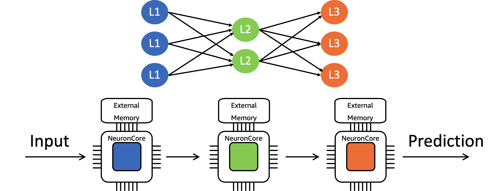

# NeuronCore Pipeline

NeuronCore Pipeline refers to the process of sharding a compute-graph across multiple NeuronCores,
caching the model parameters on each core on-chip memory, and then streaming inference requests across the cores
in a pipelined manner. This enables users to optimize for both throughput and latency, as it enables the NeuronCores to
process neural-networks with locally cached data and avoid the high cost of accessing external memory.





NeuronCore Pipeline can typically achieve maximal hardware efficiency without batching (e.g. BERT, ResNet50).
For maximal performance, users should choose an instance-size that can cache the entire model on the available NeuronCores.

For enabling the Neuron Core Pipeline optimization, the compiler should be invoked with the following flags:
`--static-weights --num-neuroncores N`. 
The number of NeuronCores is typically chosen to be the minimal number that can fit the entire model, which is currently done through a trial-and-error process (compiling to different number of cores and looking for compilation success/failure message).
This process will be automated in the future.

The code snippet below shows how to compile a model with NeuronCore Pipeline for 16 NeuronCores (instance size inf1.6xl).

```
import numpy as np
import tensorflow.neuron as tfn

example_input = np.zeros([1,224,224,3], dtype='float16')
tfn.saved_model.compile("rn50_fp16", 
                        "rn50_fp16_compiled/1", 
                        model_feed_dict={'input_1:0' : example_input },
                        compiler_args = ['--static-weights', '--num-neuroncores', '16'])
```


